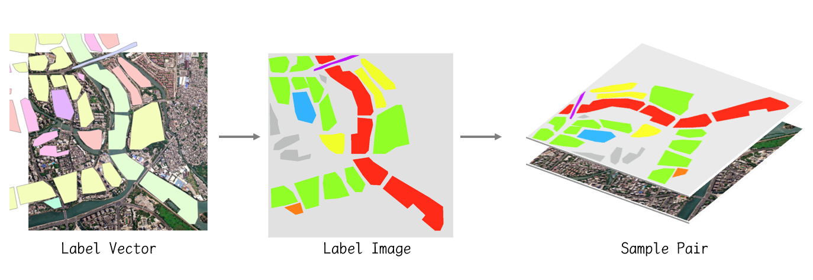

# ShpLabel2ImgLabel

基于rasterio和geopandas，实现将Shapefile标注数据转换为与遥感影像像素对齐的图像标签。



## usage

```python
from BatchLabel import BatchLabel

batch_handler = BatchLabel()
rs_dir = './rs/'
shp_dir = './shp/'
out_dir = './out/'
batch_handler.run(shp_dir, rs_dir, out_dir)
```

更多示例，可参考：[examples](https://github.com/no-con/ShpLabel2ImgLabel/tree/main/examples)